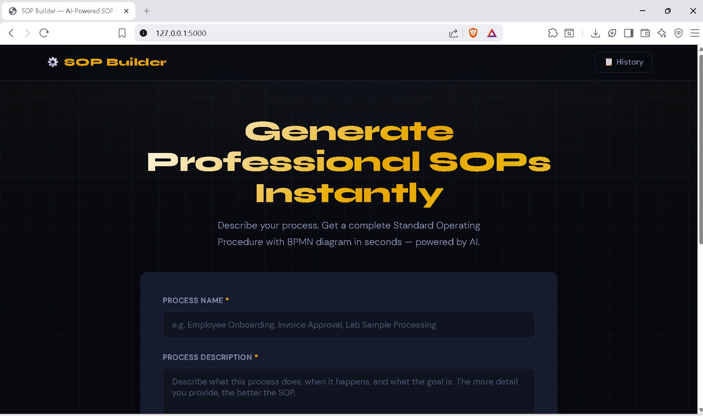

<div align="center">



<br/>
<br/>

# ⚙️ SOP Builder

### AI-Powered Standard Operating Procedure Generator

[](https://python.org)
[](https://flask.palletsprojects.com)
[](https://aistudio.google.com)
[](https://console.groq.com)
[](LICENSE)

**[🌐 Live Demo](https://sopbuilder.muntworld.com)** &nbsp;|&nbsp;
**[📋 Documentation](#how-to-use)** &nbsp;|&nbsp;
**[🚀 Quick Start](#local-setup)**

</div>

---

## 👥 Authors

<table>
<tr>
<td align="center"><b>Siddique Abubakr Muntaka</b></td>
<td align="center"><b>Dogbe Abigail</b></td>
</tr>
</table>

> **Course:** AI for SOPs and Process Documentation
> **School:** School of Information Technology, University of Cincinnati
> **Professor:** Dr. Michael Zidar

---

## ✨ What It Does

SOP Builder takes a plain-text process description and produces a complete, professional documentation package in seconds — powered by dual AI engines with automatic failover.

| Output | Description |
|--------|-------------|
| 📄 **SOP Document** | Complete 8-section Standard Operating Procedure |
| 📊 **Process Diagram** | Interactive flowchart rendered live in browser |
| 🖨️ **Clean PDF Export** | Professional white-background document |
| ⬇️ **Markdown Download** | Portable `.md` file for any editor |
| ⬇️ **BPMN XML Download** | Industry-standard process model file |
| ⬇️ **PNG Diagram** | High-resolution diagram image |

---

## 🤖 AI Stack
Both APIs are called directly over HTTP — zero SDK dependencies, works on any Python version.

---

## 🛠️ Tech Stack

---

## 🚀 Local Setup

### 1. Clone the repository

```bash
git clone https://github.com/abksiddique/sop-builder.git
cd sop-builder
```

### 2. Create virtual environment

```bash
python -m venv venv
source venv/Scripts/activate   # Windows Git Bash
source venv/bin/activate        # Linux / Mac
```

### 3. Install dependencies

```bash
pip install -r requirements.txt
```

### 4. Configure environment variables

```bash
cp .env.example .env
```

Edit `.env` with your API keys:

```env
GEMINI_API_KEY=your_gemini_key_here
GROQ_API_KEY=your_groq_key_here
SECRET_KEY=your_random_secret_here
```

Get free API keys:
- 🔑 Gemini → https://aistudio.google.com
- 🔑 Groq → https://console.groq.com

### 5. Run

```bash
python run.py
```

Visit → **http://127.0.0.1:5000**

---

## 📖 How to Use

1. Enter a **process name** and **description**
2. Optionally add **roles** and **known exceptions**
3. Click **⚡ Generate SOP + BPMN Diagram**
4. View the generated **SOP Document** tab
5. Click **Process Diagram** tab to see the flowchart
6. Export using any of the download buttons
7. All SOPs are saved and accessible via **History**

---

## 📁 Project Structure

---

## 🌐 Deployment

Live at → **https://sopbuilder.muntworld.com**

Deployed on VPS using **Gunicorn + Nginx** with a systemd service for automatic restarts.

---

## 📜 License

MIT License — free to use, modify, and distribute.

---

<div align="center">

Built with ❤️ by **Siddique Abubakr Muntaka** & **Dogbe, Abigail**
School of Information Technology · University of Cincinnati · 2025

</div>

